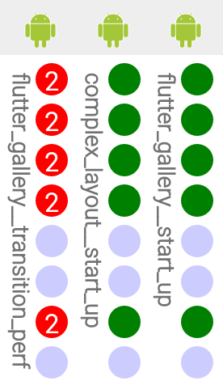

# Flutter devicelab

"Devicelab" (a.k.a. "cocoon") is a physical lab that tests Flutter on real
Android and iOS devices.

This package contains the code for test framework and the tests. More generally
the tests are referred to as "tasks" in the API, but since we primarily use it
for testing, this document refers to them as "tests".

If you have access to Google's internal network, you can see the continuous
build results from the master branch at <http://go/flutter-dashboard/build.html>.
(There is currently no public view of this data, unfortunately.)

# Prerequisites

You must set the `ANDROID_HOME` environment variable to run tests on Android. If
you have a local build of the Flutter engine, then you have a copy of the
Android SDK at `.../engine/src/third_party/android_tools/sdk`.

# Running tests locally

Do make sure your tests pass locally before deploying to the CI environment.
Below is a handful of commands that run tests in a similar way to how the
CI environment runs them. These commands are also useful when you need to
reproduce a CI test failure locally.

To run a test, use option `-t` (`--task`):

```sh
# from the .../flutter/dev/devicelab directory
dart bin/run.dart -t {NAME_OR_PATH_OF_TEST}
```

Where `NAME_OR_PATH_OF_TEST` can be either of:

- the _name_ of a task, which you can find in the `manifest.yaml` file in this
  directory. Example: `complex_layout__start_up`.
- the path to a Dart _file_ corresponding to a task, which resides in `bin/tasks`.
  Tip: most shells support path auto-completion using the Tab key. Example:
  `bin/tasks/complex_layout__start_up.dart`.

To run multiple tests, repeat option `-t` (`--task`) multiple times:

```sh
dart bin/run.dart -t test1 -t test2 -t test3
```

To run all tests defined in `manifest.yaml`, use option `-a` (`--all`):

```sh
dart bin/run.dart -a
```

To run tests from a specific stage, use option `-s` (`--stage`):

```sh
dart bin/run.dart -s {NAME_OF_STAGE}
```

Currently there are only three stages defined, `devicelab`, `devicelab_ios` and `devicelab_win`.

# Reproducing broken builds locally

If a commit caused a test to fail,
[the dashboard](http://go/flutter-dashboard/build.html) (requires access to the
Google network, sorry) might look something like this:



The red circle tells you that a test failed. The number inside tells you how
many times the devicelab attempted to run the test before giving up on it.

To reproduce the breakage locally `git checkout` the corresponding Flutter
revision. Note the name of the test that failed. In the example above the
failing test is `flutter_gallery__transition_perf`. This name can be passed to
the `run.dart` command. For example:

```sh
dart bin/run.dart -t flutter_gallery__transition_perf
```

# Writing tests

A test is a simple Dart program that lives under `bin/tests` and uses
`package:flutter_devicelab/framework/framework.dart` to define and run a _task_.

Example:

```dart
import 'dart:async';

import 'package:flutter_devicelab/framework/framework.dart';

Future<Null> main() async {
  await task(() async {
    ... do something interesting ...

    // Aggregate results into a JSONable Map structure.
    Map<String, dynamic> testResults = ...;

    // Report success.
    return new TaskResult.success(testResults);

    // Or you can also report a failure.
    return new TaskResult.failure('Something went wrong!');
  });
}
```

Only one `task` is permitted per program. However, that task can run any number
of tests internally. A task has a name. It succeeds and fails independently of
other tasks, and is reported to the dashboard independently of other tasks.

A task runs in its own standalone Dart VM and reports results via Dart VM
service protocol. This ensures that tasks do not interfere with each other and
lets the CI system time out and clean up tasks that get stuck.

# Adding tests to the CI environment

The `manifest.yaml` file describes a subset of tests we run in the CI. To add
your test edit `manifest.yaml` and add the following in the "tasks" dictionary:

```
  {NAME_OF_TEST}:
    description: {DESCRIPTION}
    stage: {STAGE}
    required_agent_capabilities: {CAPABILITIES}
```

Where:

 - `{NAME_OF_TEST}` is the name of your test that also matches the name of the
 file in `bin/tests` without the `.dart` extension.
 - `{DESCRIPTION}` is the plain English description of your test that helps
 others understand what this test is testing.
 - `{STAGE}` is `devicelab` if you want to run on Android, or `devicelab_ios` if
 you want to run on iOS.
 - `{CAPABILITIES}` is an array that lists the capabilities required of
 the test agent (the computer that runs the test) to run your test. Available
 capabilities are: `has-android-device`, `has-ios-device`.
